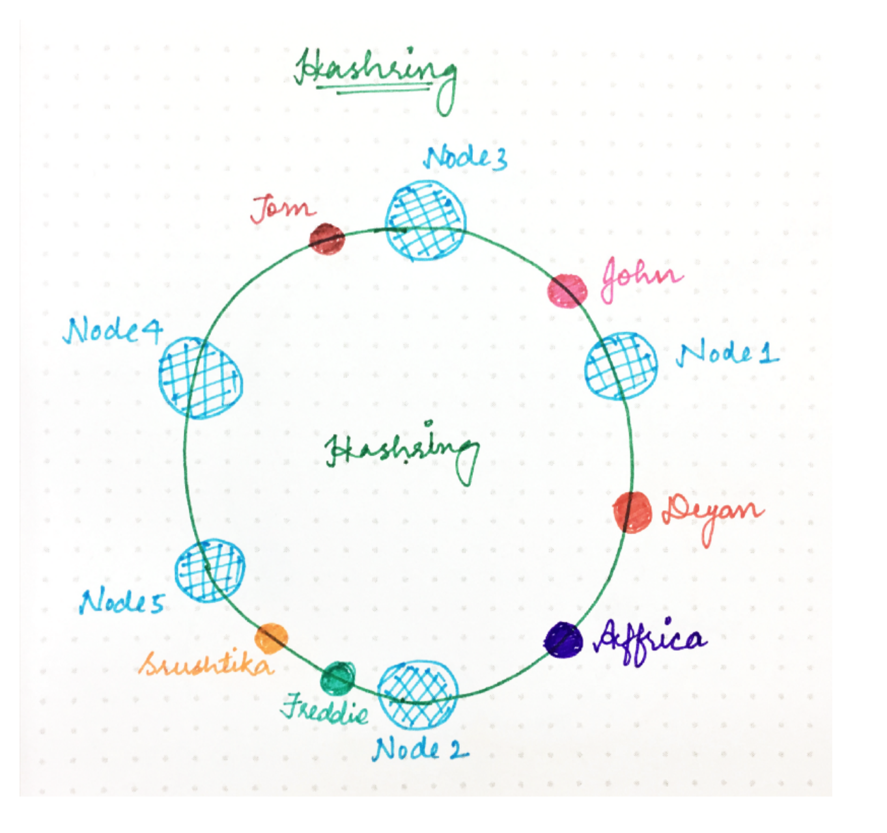
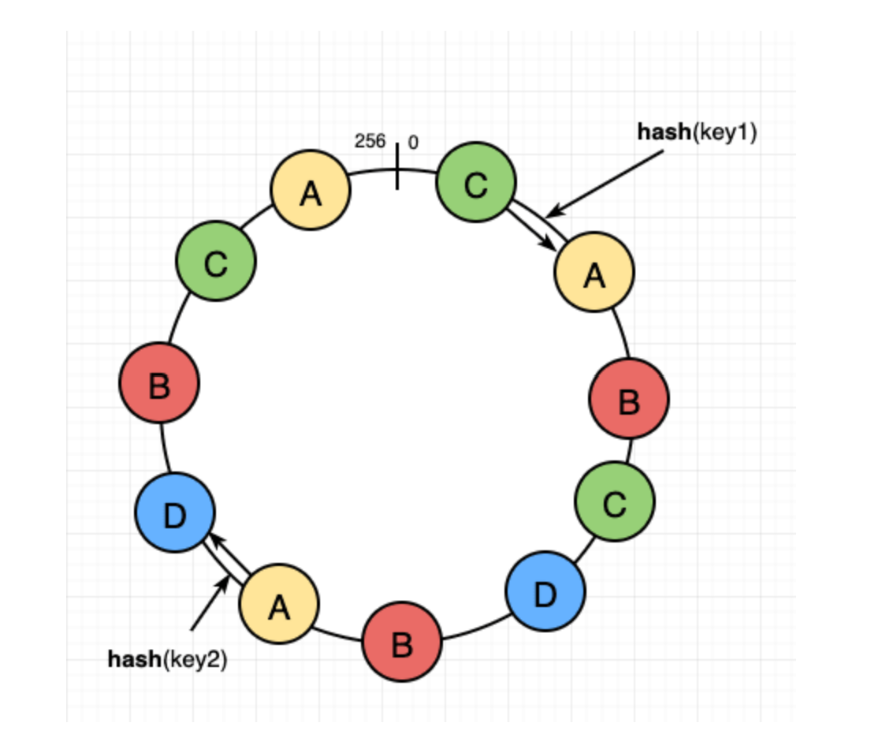

# Consistent Hashing 
> Used to distribute data across multiple servers while minimizing the impact of adding or removing servers from the system.

# Working
Sure, here's a step-by-step explanation of how consistent hashing works:

1. **Hash Function Selection**:
    - Choose a hash function that takes a data item (e.g., a key or object) as input and produces a hash value as output.
    - The hash function should have properties like uniformity and randomness to evenly distribute hash values across a range.

2. **Node Hashing**:
    - Each node in the system (e.g., servers, storage nodes) is hashed using the same hash function to generate a hash value.
    - The hash value determines the position of the node on a hash ring, which is typically represented as a circular space with hash values distributed along its circumference.

3. **Data Hashing**:
    - When a data item needs to be stored or accessed, it is hashed using the same hash function used for node hashing.
    - The hash value of the data item determines its position on the hash ring as well.

4. **Node Assignment**:
    - Each data item is assigned to the node whose hash value is closest (in a clockwise direction) to the hash value of the data item on the hash ring.
    - If the hash value of the data item falls between two consecutive nodes on the ring, it is assigned to the next node in the clockwise direction.

5. **Data Retrieval**:
    - When a data item needs to be retrieved, the same hash function is applied to the item to determine its hash value and position on the hash ring.
    - The data item is then routed to the node whose hash value is closest to the hash value of the data item on the ring.

6. **Node Addition/Removal**:
    - When a new node is added to the system or an existing node is removed, only a fraction of the data items need to be remapped to different nodes.
    - The majority of data items remain assigned to their existing nodes, as the positions of nodes on the hash ring change minimally.

7. **Load Balancing**:
    - Consistent hashing promotes balanced data distribution across nodes, even when the number of nodes is uneven or changes dynamically.
    - This helps distribute the workload evenly across nodes and ensures efficient resource utilization in the system.

By following these steps, consistent hashing efficiently distributes data across nodes in a distributed system while minimizing the impact of node additions, removals, or changes in the system's topology.

# Example
- Imagine a circle with points from [0, 10^18]. 
- Imagine there is a hash function H1, which maps every machineId to a number in [0, 10^18], which you then mark on the circle.
- Similarly, there is another hash function H which maps userId to [0, 10^18].
- Let’s assume we assign a user to be present on the first machine in the cyclic order from the hash of the user. 

- For example, in the diagram above, Deyan and Affrica are assigned to Node 2, Freddie and Srushtika on Node 5 and so on.
- In implementation, if you have a sorted array with hashes of nodes, then for every user, you calculate the hash, and then binary search for the first number bigger than the given hash. 
- That machine is what the user will be assigned to.

- However, this design suffers from an issue.
- What happens when you remove a shard.
- Let’s say Node 2 is down. 
- All load of Node 2 (Deyan + Africa) get assigned to Node 5 and Node5’s load basically doubles. 
- At such high load, there is a good probability that Node 5 dies which will triple the load for Node 4.
- Node4 can also die and it will trigger cascading failure. 

So, we modify the consistent hashing a little bit. 

- Instead of one hash per machine, you use multiple hashing functions per machine (the more, the better). 
- So, Node 1 is present at multiple places, Node 2 at multiple places and so forth. 

In the above example, if node A dies, some range of users is assigned to B, some to D and some to C. That is the ideal behavior.

